# Movie App

## Features
*  Headline News
*  Search News


## 📸 Example iOS
<pre>
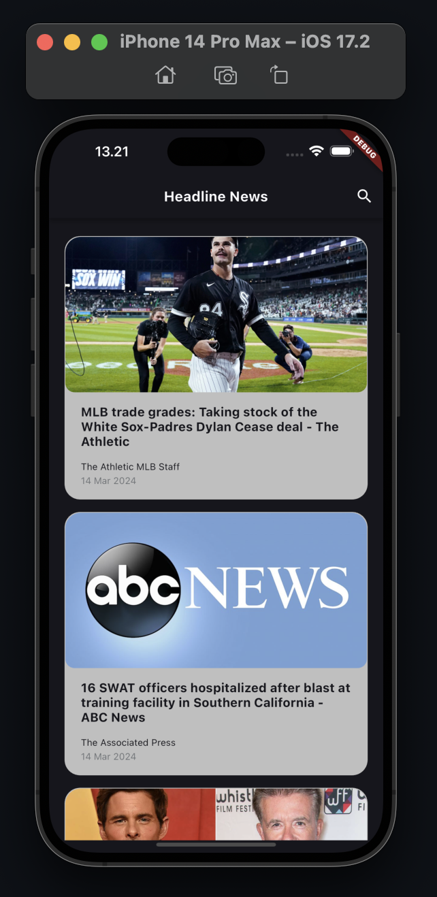     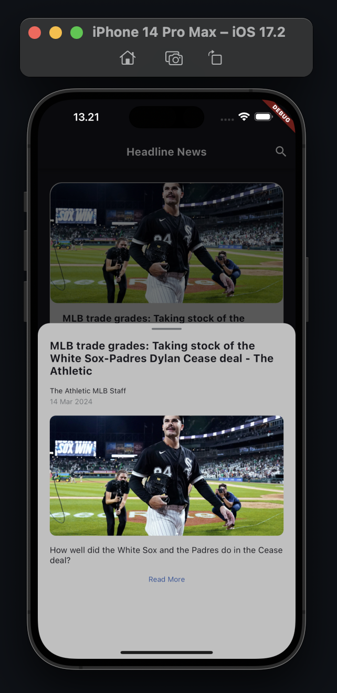     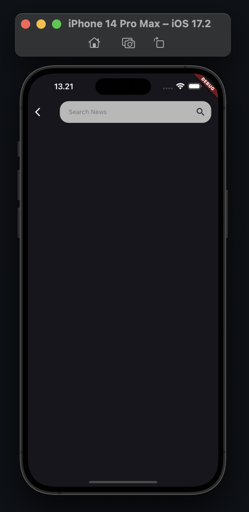     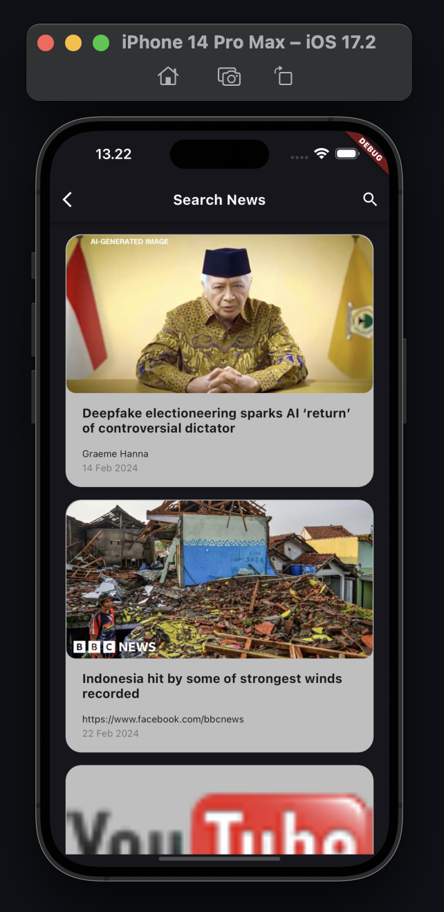     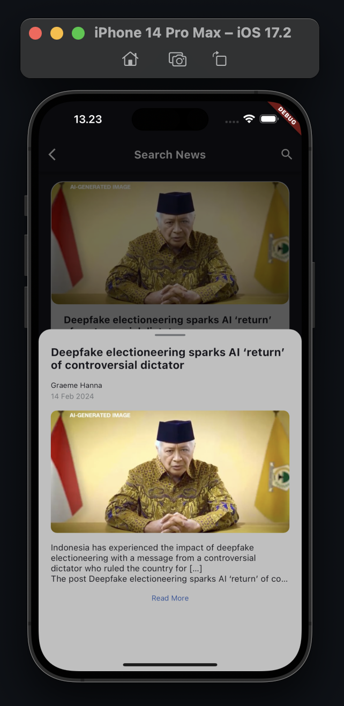     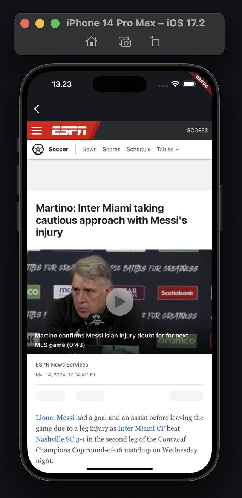
</pre>


## 📸 Example Android
<pre>
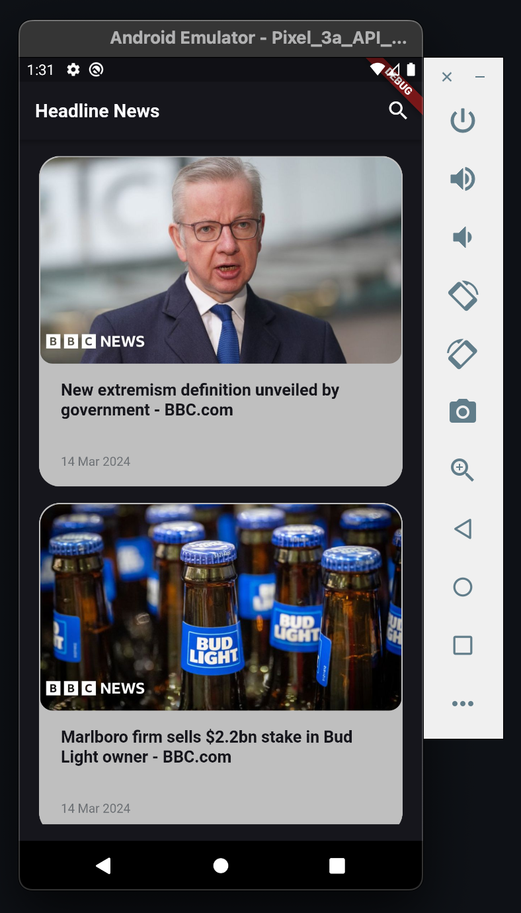     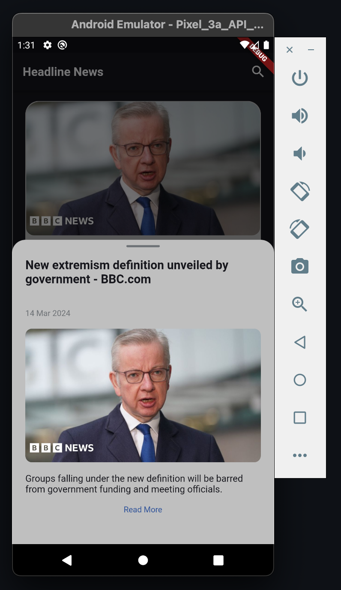     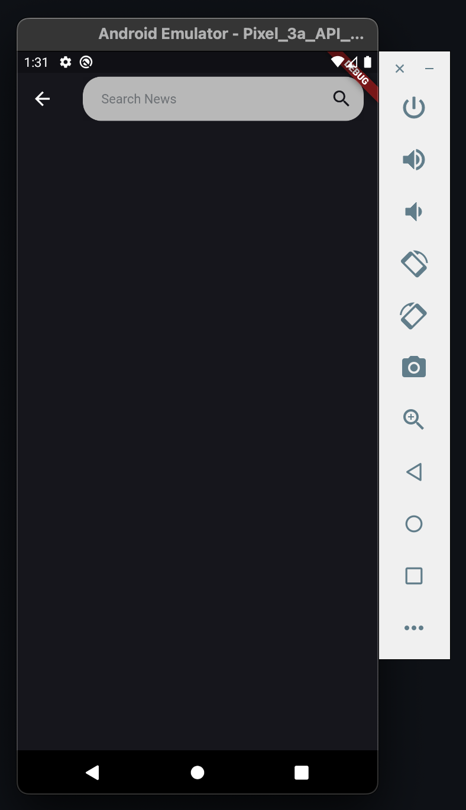     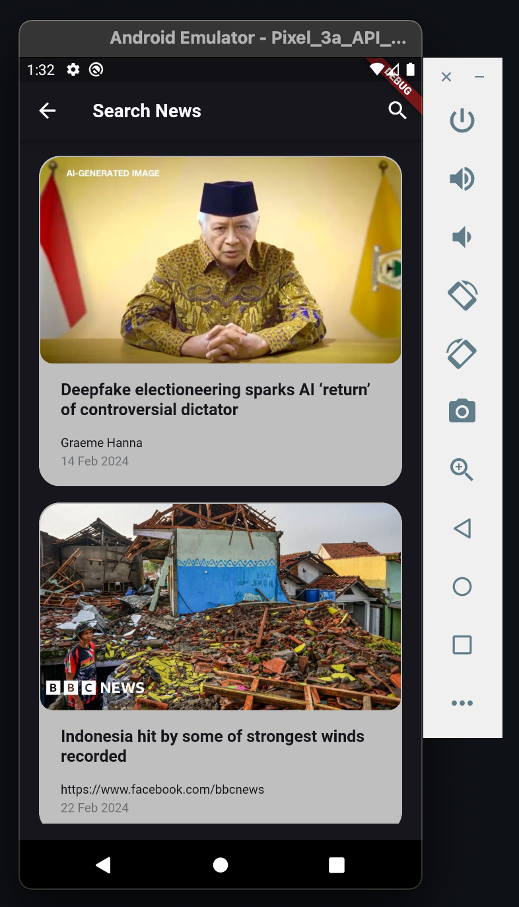     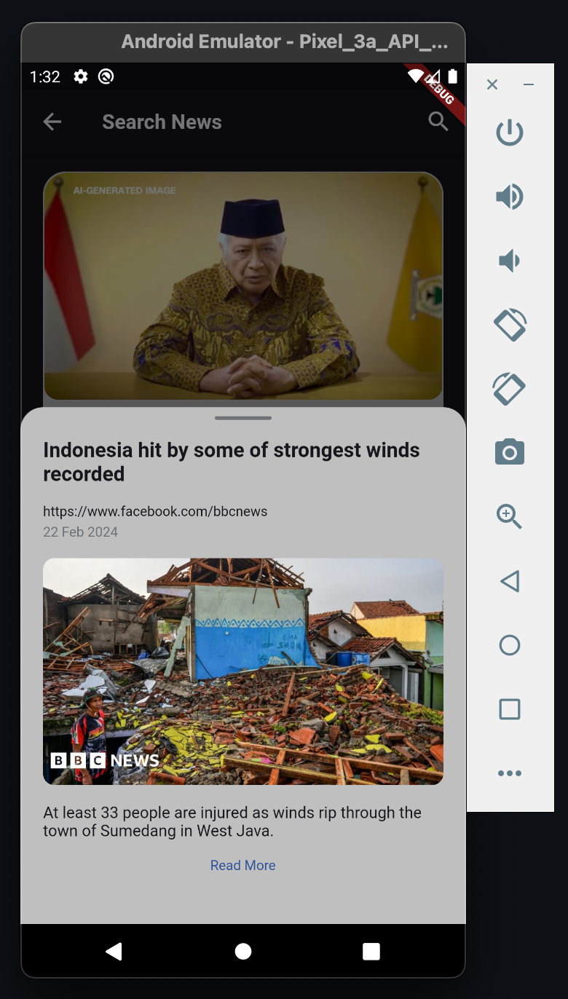     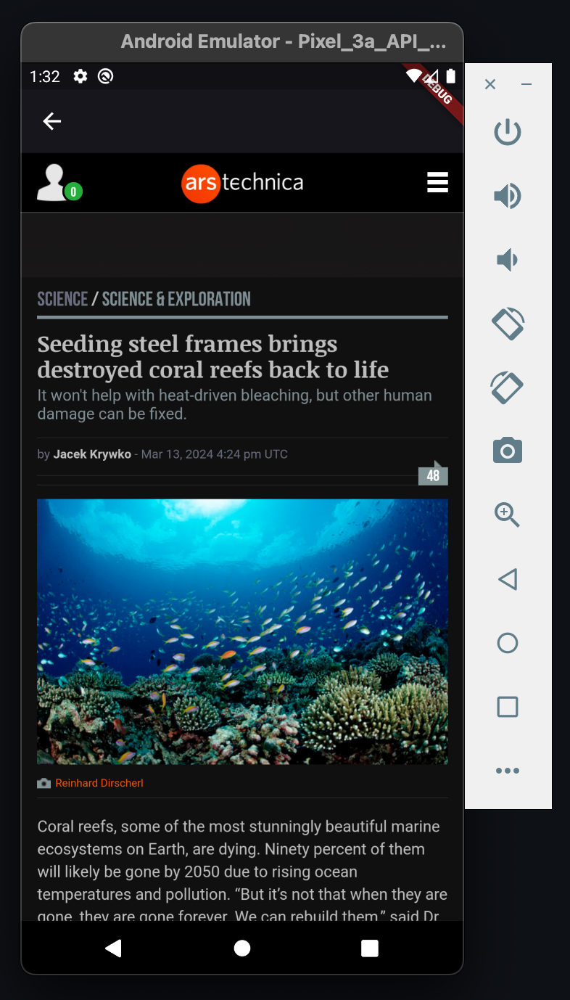
</pre>


## Quick start
This is a normal flutter app. You should follow the instructions in the [official documentation](https://flutter.io/docs/get-started/install).
This project uses **BLoC** (business logic component) to separate the business logic with UI itself.
It's recommended to do self-study about it before jumping into the project [here](https://bloclibrary.dev/).


## Built With 🛠
* [BLoC Pattern](https://bloclibrary.dev/) - Business logic component to separate the business logic with UI.
* [Equatable](https://pub.dev/packages/equatable) - Being able to compare objects in `Dart` often involves having to override the `==` operator.
* [Dio](https://github.com/flutterchina/dio/) - A type-safe HTTP client.
* [Shared Preferences](https://pub.dev/packages/shared_preferences) - Cache implementation approach.
* [Shimmer](https://pub.dev/packages/shimmer) - Loading handler.
* Handle State - (Loading, No Data, Has Data, No Internet Connection, Request Timeout, Error)
* [Get It](https://pub.dev/packages/get_it) - A Dependency Injection


## How to run the App
1. Clone this project.
2. Open with your favorite tools editor.
3. Run `Pub get` on each module sequentially starting from `dependencies`, `core`, `shared`, and `your root project` to generated `pubspec.lock` file.
4. Add your `apiKey` into ***api_constant.dart*** file.


## Author

* **Muhammad Hendriawan**

## License

```
MIT License

Copyright (c) [2024] [Muhammad Hendriawan]

Permission is hereby granted, free of charge, to any person obtaining a copy
of this software and associated documentation files (the "Software"), to deal
in the Software without restriction, including without limitation the rights
to use, copy, modify, merge, publish, distribute, sublicense, and/or sell
copies of the Software, and to permit persons to whom the Software is
furnished to do so, subject to the following conditions:

The above copyright notice and this permission notice shall be included in all
copies or substantial portions of the Software.

THE SOFTWARE IS PROVIDED "AS IS", WITHOUT WARRANTY OF ANY KIND, EXPRESS OR
IMPLIED, INCLUDING BUT NOT LIMITED TO THE WARRANTIES OF MERCHANTABILITY,
FITNESS FOR A PARTICULAR PURPOSE AND NONINFRINGEMENT. IN NO EVENT SHALL THE
AUTHORS OR COPYRIGHT HOLDERS BE LIABLE FOR ANY CLAIM, DAMAGES OR OTHER
LIABILITY, WHETHER IN AN ACTION OF CONTRACT, TORT OR OTHERWISE, ARISING FROM,
OUT OF OR IN CONNECTION WITH THE SOFTWARE OR THE USE OR OTHER DEALINGS IN THE
SOFTWARE.
```
